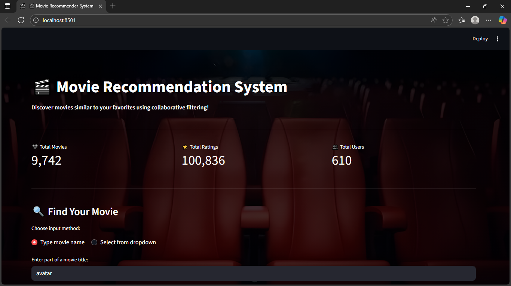
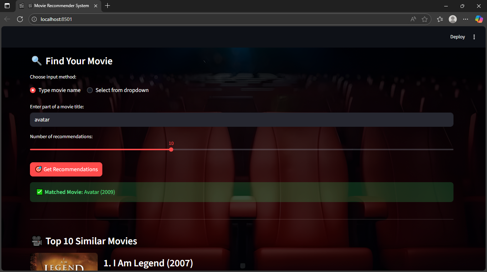
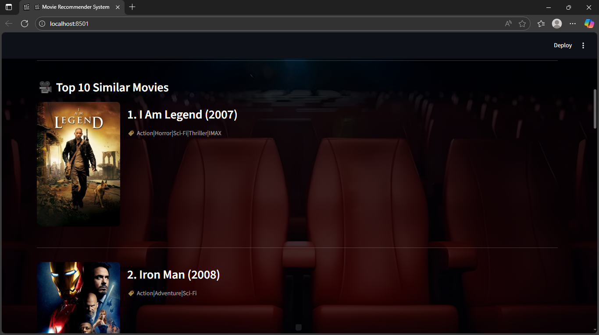
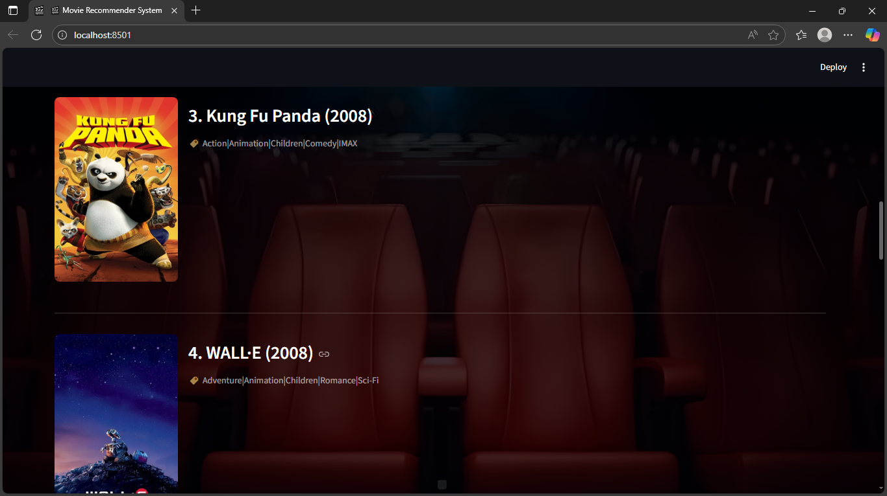
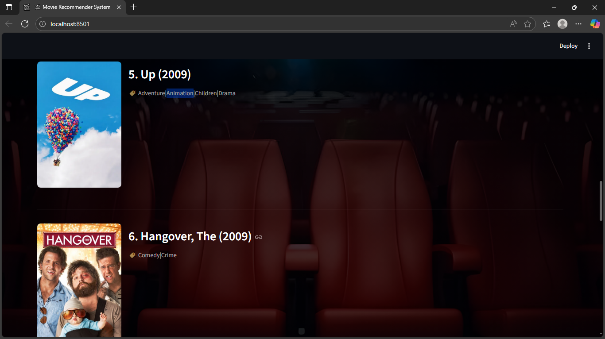
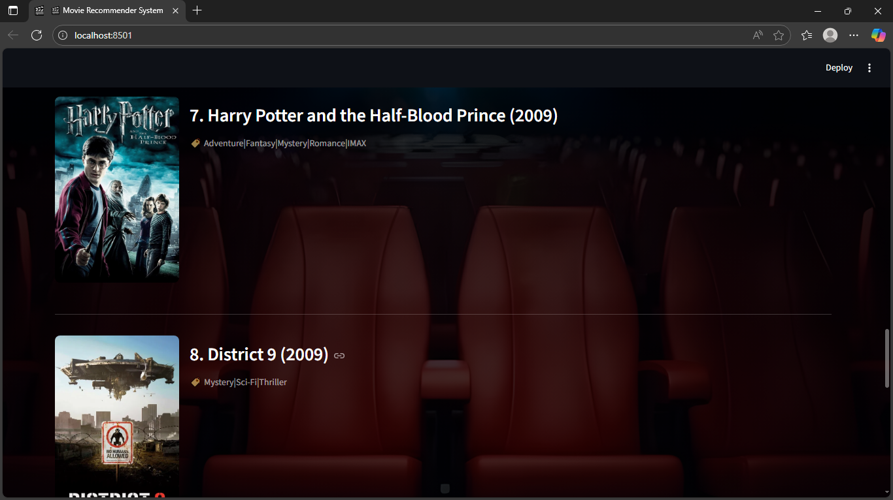
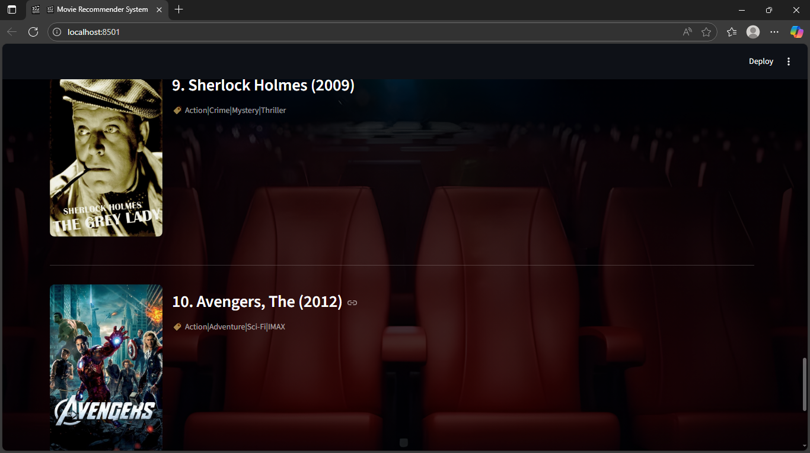
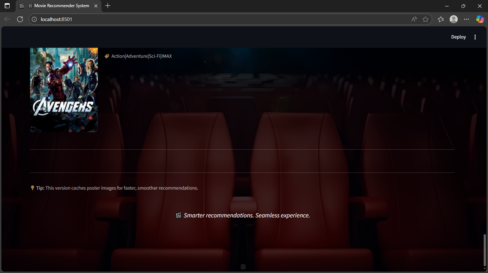

# 🎬 Movie Recommendation System

A **content-based movie recommender system** built with **Streamlit**, **pandas**, and **scikit-learn**.  
It suggests movies similar to your favorites using precomputed cosine similarity scores from user ratings.

---

## 🚀 Features

- 🔍 Search movies by name (partial or full)
- 🎯 Get top N similar movie recommendations
- 🧠 Uses cosine similarity on movie rating vectors
- 🖼️ Displays movie posters via TMDB API
- ⚡ Cached loading for faster performance
- 🌈 Clean Streamlit UI with background image and metrics

---

## 📁 Project Structure

movie-recommender/
│
├── app.py # Main Streamlit web app
├── generate_pickle.py # Script to generate movie_data.pkl
├── data/
│ ├── movies.csv # Movie metadata
│ └── ratings.csv # User ratings
│
├── background.png # Background image for the UI
├── requirements.txt # Python dependencies
├── .gitignore # Files/folders to ignore in Git
└── README.md # Project documentation


---

## ⚙️ Setup Instructions

### 1️⃣ Clone the Repository

```bash
git clone https://github.com/Harshith-0112/movie-recommender.git
cd movie-recommender

2️⃣ Create a Virtual Environment

python -m venv venv

Activate it:

Windows: venv\Scripts\activate

Mac/Linux: source venv/bin/activate

3️⃣ Install Dependencies

pip install -r requirements.txt

🧠 Generating the Pickle File

The file movie_data.pkl (which contains all preprocessed data) is required by app.py.

To generate it:

1.Make sure your movies.csv and ratings.csv are inside the data/ folder.

2.Run the following command:

python generate_pickle.py

3.After it finishes, you’ll see:

✅ Pickle file saved successfully at: movie_data.pkl

This file will be used automatically by the Streamlit app.

Once movie_data.pkl is ready, launch the app:

streamlit run app.py

Then open the local URL (usually http://localhost:8501) to explore the app.

📦 Requirements

See requirements.txt
 for the complete list.
Key libraries used:

streamlit
pandas
numpy
scikit-learn
joblib
requests

requests

## 🧩 Dataset

This project uses data in the **MovieLens dataset format**.  
All CSV files are included under the `data/` folder:

| File | Description |
|------|--------------|
| **movies.csv** | Contains movie IDs, titles, and genres |
| **ratings.csv** | User ratings for movies (userId, movieId, rating, timestamp) |
| **tags.csv** | Optional tags added by users to describe movies |
| **links.csv** | Provides external links such as IMDB and TMDB IDs |

Only `movies.csv` and `ratings.csv` are required to generate the `movie_data.pkl` file.  
`tags.csv` and `links.csv` are included for completeness and potential future extensions.

You can replace these files with your own dataset as long as the structure remains the same.

## 🖼️ Screenshots

### 🎬 Home Page


### 🎯 Recommendation Example









🧑‍💻 Author

Your Harshith Thota
📧 [harshiththota2004@gmail.com]
🌐 https://github.com/Harshith-0112

🏁 License

This project is licensed under the MIT License — feel free to use and modify it.